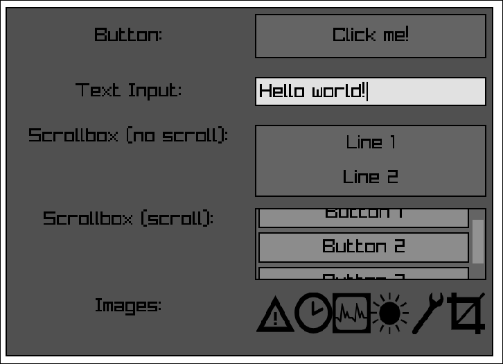

# exigent - Odin Immediate Mode UI (early WIP)

This is a simple immediate mode UI written in Odin as an exploratory exercise in recreational programming. 

For layout this package uses the RectCut strategy which enables UI widgets to create children as subdivided sections of themselves. This strategy was selected because it is very simple and easy to implement as it does not require a complex layout calculation algorithm. Each widget with children is responsible for calculating the size of each child. This starts at the root UI widget and continues down for all children recursively.  

Rendering uses a Command queue design where widgets are iterated starting from the root following a Breadth-First Search (BFS) pattern. For each widget, one or more Commands to draw are pushed into the queue. The queue can then be iterated and drawn by any graphical engine. Currently the `demo` uses Raylib. 

The name `exigent` means "requiring immediate action".

## Sample

This sample contains all the available widgets so far.
